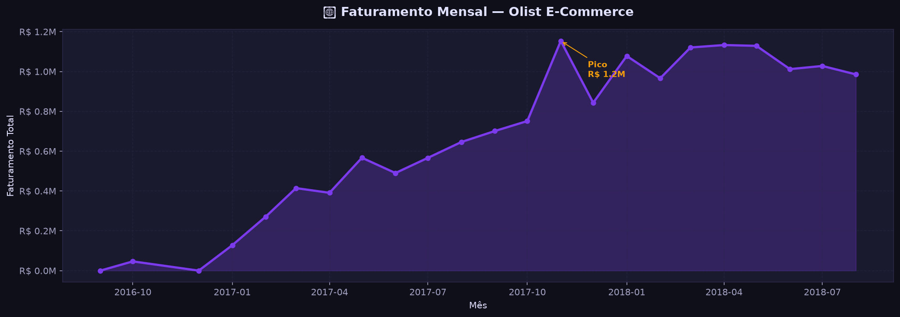
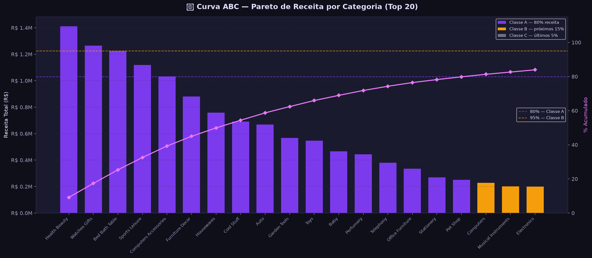
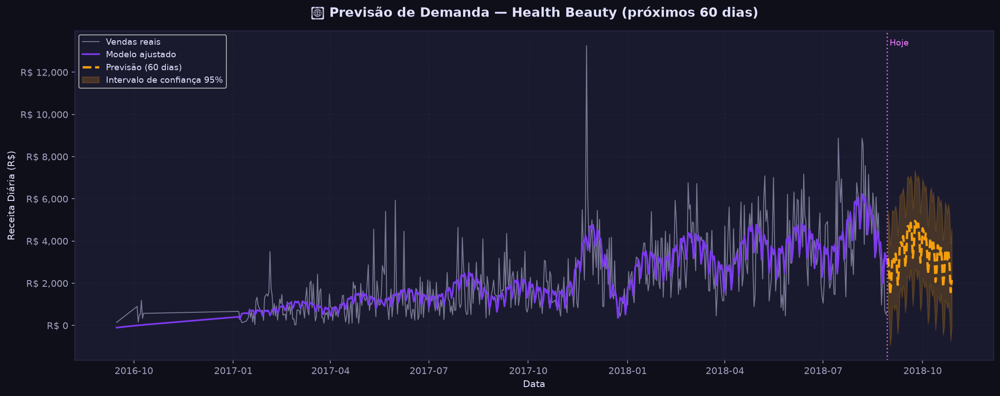

<div align="center">


<br/>

[](https://python.org)
[](https://jupyter.org/)
[](https://facebook.github.io/prophet/)
[](https://pandas.pydata.org/)
[](https://www.kaggle.com/datasets/olistbr/brazilian-ecommerce)
[](https://creativecommons.org/licenses/by-nc-sa/4.0/)

</div>

---

## 📸 Resultados Reais do Notebook

<div align="center">
  
  <br/>
  <em>📈 Faturamento mensal — crescimento de R$0 até R$1.2M entre 2016 e 2018 (Dataset Olist)</em>
</div>

<br/>

<div align="center">
  
  <br/>
  <em>📊 Curva ABC — Top 20 categorias por receita, com classificação Pareto (80/15/5%)</em>
</div>

<br/>

<div align="center">
  
  <br/>
  <em>🔮 Previsão de demanda com Meta Prophet — próximos 60 dias com intervalo de confiança 95% (categoria Health Beauty)</em>
</div>

---

## 🧠 Sobre o Projeto

Este projeto nasceu de uma dúvida bem prática: **como usar dados históricos de vendas para tomar decisões melhores de estoque?**

Peguei o dataset público da **Olist** — mais de **100 mil pedidos reais** do e-commerce brasileiro — e construí uma análise completa, do zero até previsão de demanda com **Machine Learning**.

> 📌 **Contexto de negócio:** Gestores de estoque enfrentam dois problemas caros: produto em falta (perde venda) e excesso de estoque (imobiliza capital). Com análise de dados e ML, dá para equilibrar os dois.

---

## 🔄 Pipeline da Análise

```
┌─────────────┐    ┌─────────────┐    ┌─────────────┐    ┌─────────────┐
│  📥 Ingestão │ ──► │  🧹 Limpeza  │ ──► │  📊 Análise  │ ──► │  🤖 Previsão│
│  Dataset    │    │  & Preparo  │    │  Explorat.  │    │  Prophet ML │
│  Olist CSV  │    │  Pandas     │    │  Seaborn    │    │  60 dias    │
└─────────────┘    └─────────────┘    └─────────────┘    └─────────────┘
                                                                 │
                                                                 ▼
                                                    ┌─────────────────────┐
                                                    │  📋 Relatório Final  │
                                                    │  Recomendações de   │
                                                    │  Gestão de Estoque  │
                                                    └─────────────────────┘
```

---

## ✨ O que o Projeto Faz

| Etapa | O que acontece |
|---|---|
| 📥 **Carregamento** | Lê os CSVs do Olist (pedidos, produtos, clientes, pagamentos) |
| 🧹 **Limpeza** | Trata datas, nulos, pedidos cancelados e outliers |
| 📊 **Curva ABC** | Classifica categorias por receita — quem gera 80% do faturamento? |
| 📅 **Sazonalidade** | Mapeia como as vendas variam por mês, semana e dia |
| 🤖 **Previsão ML** | Usa Prophet para projetar os próximos **60 dias** de demanda |
| 📋 **Conclusões** | Relatório com recomendações práticas para gestão de estoque |

---

## 🛠️ Tecnologias

| Biblioteca | Versão | Para quê |
|---|---|---|
| `pandas` | 2.0+ | Manipulação e limpeza dos dados |
| `numpy` | 1.24+ | Cálculos numéricos e vetorização |
| `matplotlib` | 3.7+ | Geração de gráficos |
| `seaborn` | 0.12+ | Estilo visual dos gráficos |
| `prophet` | 1.1+ | Previsão de séries temporais (Meta AI) |
| `jupyter` | 7.0+ | Ambiente interativo de análise |

---

## 🚀 Como Rodar

### 1. Clone o repositório

```bash
git clone https://github.com/GuGMantellis/Otimizacao-Estoque-Olist.git
cd Otimizacao-Estoque-Olist
```

### 2. Crie o ambiente virtual (recomendado)

```bash
# Windows
python -m venv .venv
.venv\Scripts\activate

# Linux/Mac
python3 -m venv .venv
source .venv/bin/activate
```

### 3. Instale as dependências

```bash
pip install -r requirements.txt
```

> ⏳ A instalação do `prophet` pode demorar alguns minutos — ela compila o Stan.

### 4. Baixe o dataset

O dataset é **público e gratuito** no Kaggle:

👉 [Brazilian E-Commerce Public Dataset by Olist](https://www.kaggle.com/datasets/olistbr/brazilian-ecommerce)

Extraia os arquivos `.csv` na pasta `data/` do projeto.

### 5. Execute o notebook

```bash
jupyter notebook analise_estoque_olist.ipynb
```

Execute as células de cima para baixo. Os gráficos e CSVs de resultado são gerados automaticamente em `output/`.

---

## 📁 Estrutura do Projeto

```
📁 Otimizacao-Estoque-Olist/
├── 📓 analise_estoque_olist.ipynb  ← Notebook principal (análise completa)
├── 📄 requirements.txt             ← Dependências Python
├── ⚙️ setup.py                     ← Instala deps e cria pastas automaticamente
├── 📁 data/                        ← Coloque os CSVs do Kaggle aqui
│   ├── olist_orders_dataset.csv
│   ├── olist_products_dataset.csv
│   └── ... (demais arquivos Olist)
├── 📁 output/                      ← Gerado ao executar o notebook
│   ├── 01_faturamento_mensal.png
│   ├── 02_vendas_por_dia.png
│   ├── 03_curva_abc.png
│   ├── 04_top_categorias_a.png
│   ├── 05_previsao_prophet.png
│   ├── 06_componentes_sazonalidade.png
│   ├── curva_abc_completa.csv
│   └── previsao_demanda.csv
└── 📁 docs/
    └── assets/
```

---

## 📊 Resultados Gerados

### 🏆 Curva ABC — Top Categorias
As categorias **A** (20% das categorias, 80% da receita) identificadas são ótimas candidatas para estratégia de reposição prioritária.

### 📅 Sazonalidade Descoberta
- **Pico de demanda:** meses de novembro/dezembro (Black Friday + Natal)
- **Baixa sazonalidade:** meses de fevereiro/março
- **Dias da semana:** Segunda e terça com maior volume de pedidos

### 🔮 Previsão de 60 dias
O modelo Prophet gera:
- Projeção de demanda com **intervalo de confiança de 95%**
- Componentes de tendência, sazonalidade semanal e anual
- CSV exportável para uso em sistemas de gestão

---

## 💡 Aplicações Práticas

> Com os resultados deste projeto, é possível:
> - 📦 Orientar **compras e reposição** de estoque nas categorias certas
> - 🤝 Embasar **negociações com fornecedores** em épocas de alta demanda
> - 💰 Reduzir **capital imobilizado** em produtos de baixo giro (Classe C)
> - 📈 Planejar **campanhas e promoções** nos períodos de baixa sazonalidade

---

## 📚 Dataset

**Brazilian E-Commerce Public Dataset by Olist**

- 📅 Período: 2016 – 2018
- 📦 Volume: ~100.000 pedidos reais
- 🇧🇷 Origem: E-commerce brasileiro
- 📜 Licença: [CC BY-NC-SA 4.0](https://creativecommons.org/licenses/by-nc-sa/4.0/)

---

<div align="center">

Desenvolvido por [Gustavo Mantellis](https://github.com/GuGMantellis) 📊

[](https://www.linkedin.com/in/gustavo-guedes-mantellis-3483722b0/)


</div>
